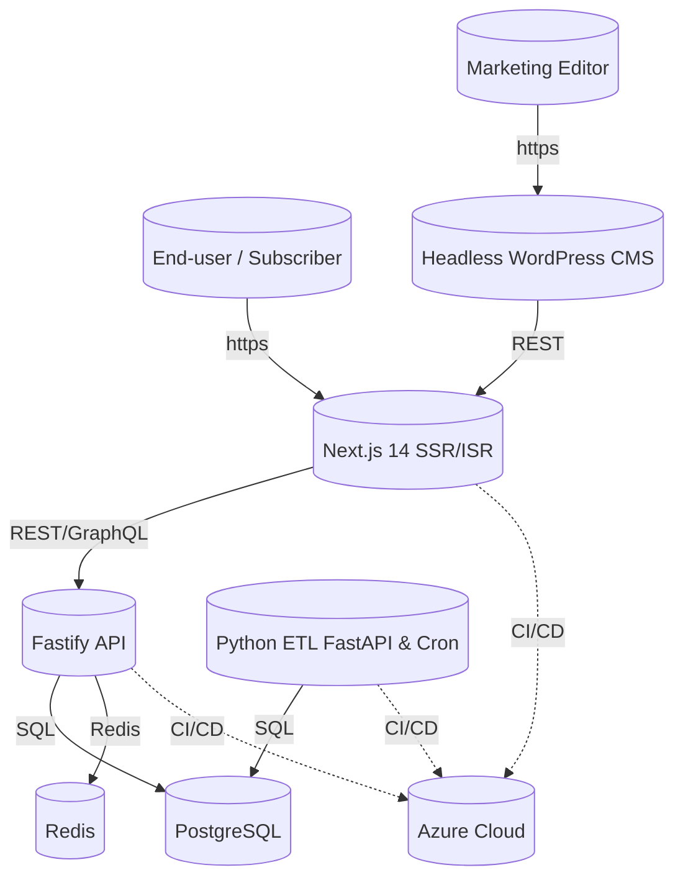

# Architecture Overview (C4 – Context & Container)

```mermaid
graph TD
  User[(End‑user / Subscriber)]
  Marketer[(Marketing Editor)]
  WordPress[(Headless WordPress CMS)]
  Frontend[("Next.js 14 SSR/ISR")]
  API[("Fastify API")]
  ETL[("Python ETL FastAPI & Cron")]
  DB[(PostgreSQL)]
  Cache[(Redis)]
  Azure[(Azure Cloud)]

  User -- https --> Frontend
  Marketer -- https --> WordPress
  Frontend -- REST/GraphQL --> API
  API -- SQL --> DB
  API -- Redis --> Cache
  ETL -- SQL --> DB
  WordPress -- REST --> Frontend
  Frontend -. CI/CD .-> Azure
  API -. CI/CD .-> Azure
  ETL -. CI/CD .-> Azure
```
